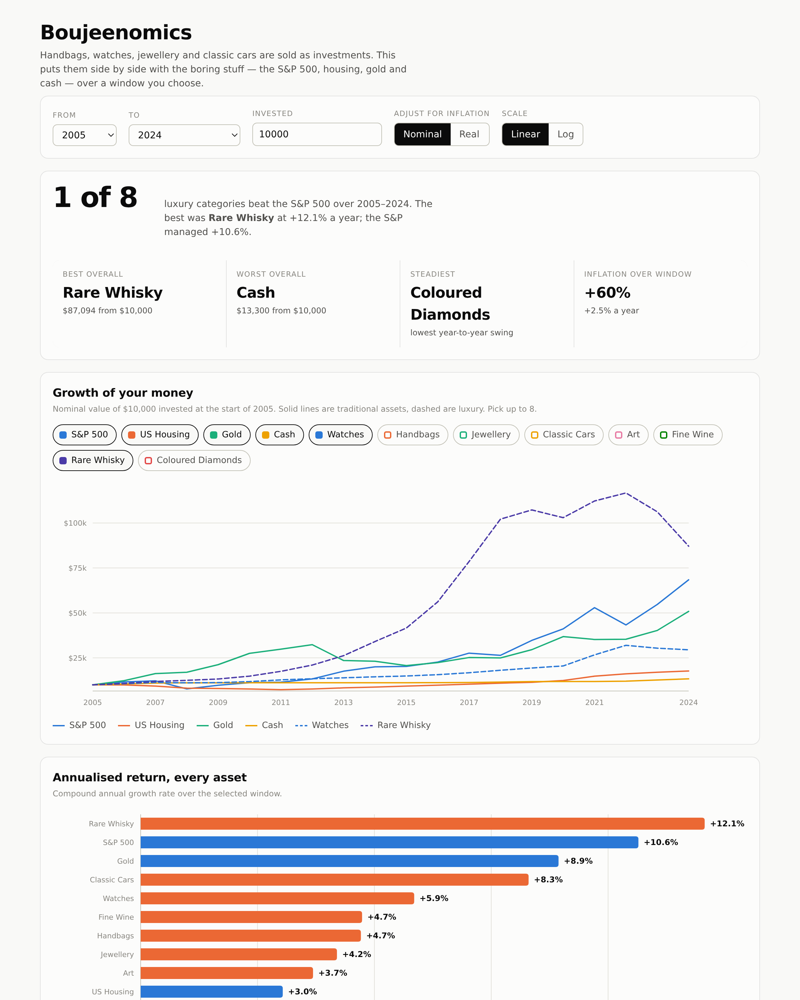

# Boujeenomics

Handbags, watches, jewellery and classic cars get sold as investments. This puts them side by side
with the boring stuff — the S&P 500, US housing, gold and cash — over any window from 2005 to 2025.



## Running it

```bash
bun run seed     # build boujee.db from data/assets.json
bun start        # http://localhost:4321
bun test         # 17 tests over the return maths
```

`bun run dev` watches and reloads. Set `PORT` to move it off 4321.

## What it shows

- **Growth of $10,000** across up to 8 assets at once, linear or log, nominal or inflation-adjusted.
- **Annualised return** for all 12 assets, traditional vs luxury.
- **A table** with total return, ending value, return versus cash, volatility, max drawdown, and
  each asset's best and worst year.
- **Provenance** for every series, because half of them are estimates and you should know which half.

The window matters more than anything else on the page. Rare whisky is the best-performing asset in
the set from 2005 and a middling one from 2015 — the 2010s boom and the 2023–24 collapse are both
inside the data, and which one you land on depends entirely on where you start.

## The data

`data/assets.json` holds every number: 20 annual total returns per asset, 2006 through 2025, plus a
CPI series used for the real-return toggle. Edit it and re-run `bun run seed`.

**The traditional series are real published data** and reconcile against the record — the S&P 500 at
10.6% a year for 2005–2024, gold at 8.9%, Case-Shiller at 3.0%, 3-month T-bills at 1.5%, CPI at +60%
cumulative.

**The luxury series are reconstructions.** They track the shape and long-run magnitude of published
luxury indices — principally the Knight Frank Luxury Investment Index, whose categories this roster
follows — but the individual annual figures are estimates, not sourced values. The broad strokes are
real and well documented: the classic car boom of 2010–2015, the watch spike of 2021–22 and its
give-back, the 2024 slumps in art and whisky. The year-by-year path between those points is my
reconstruction. Treat the luxury lines as a well-informed sketch, not a price feed. Every series
carries a `confidence` field and the app labels them `estimated` on the provenance panel.

If you have real index data, drop it into `assets.json`, flip `confidence` to `high`, and the
estimate labels disappear on their own.

### What the returns leave out

Price appreciation only. No transaction costs, insurance, storage, authentication, restoration or
tax — all of which fall far more heavily on a physical object than on an index fund. Auction houses
take 10–25% a side. The housing series is Case-Shiller price appreciation, which excludes both rent
and the cost of ownership. Auction indices also carry survivorship bias: works that fail to sell
tend to leave the index.

This is an educational tool, not investment advice.

## Layout

```
data/assets.json    every number, with source and confidence per series
src/db.ts           schema + seed (bun:sqlite)
src/analytics.ts    index building, CAGR, real adjustment, drawdown, volatility
src/server.ts       Bun.serve — /api/analysis, /api/provenance, static files
public/             the frontend; charts are hand-rolled SVG, no chart library
test/               bun test over the return maths
```

### API

`GET /api/analysis?from=2005&to=2024&real=0&amount=10000` returns per-asset index and dollar paths
plus every summary metric. `GET /api/provenance` returns the source and confidence of each series.
