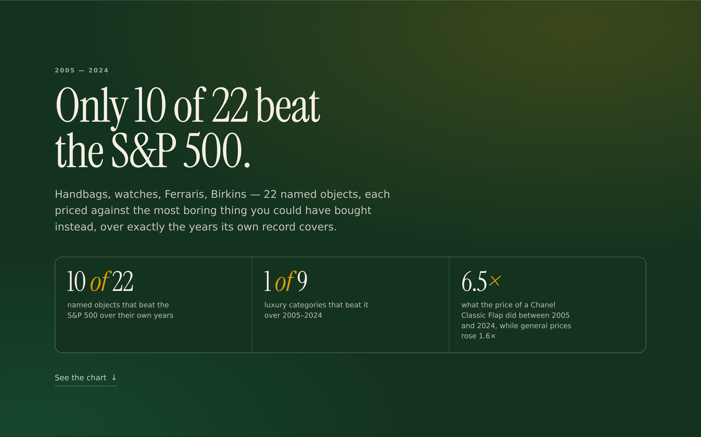
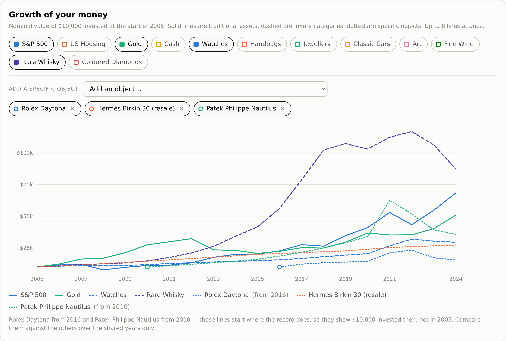
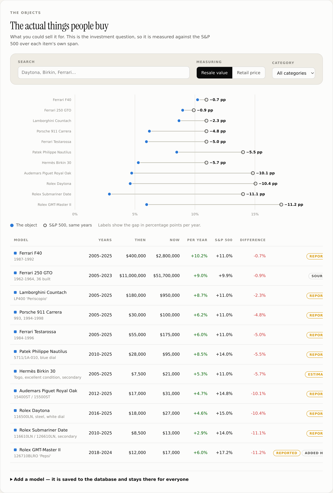
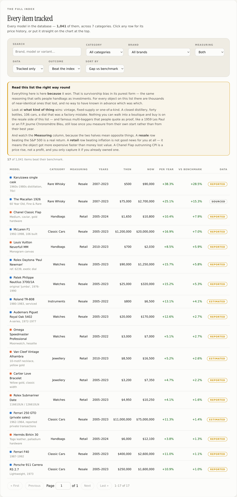

# Boujeenomics

Handbags, watches, jewellery and classic cars get sold as investments. This puts them side by side
with the boring stuff — the S&P 500, US housing, gold and cash — over any window from 2005 to 2025.










## Running it

```bash
bun run seed     # build boujee.db from data/assets.json
bun start        # http://localhost:4321
bun test         # 65 tests
```

`bun run dev` watches and reloads. Set `PORT` to move it off 4321.

## What it shows

- **Growth of $10,000** across up to 8 lines at once — categories *and* individual objects on the
  same axis — linear or log, nominal or inflation-adjusted.
- **Annualised return** for all 12 categories, traditional vs luxury.
- **The actual objects** — 17 named models (Daytona, Nautilus, Birkin, Chanel Flap, F40, 250 GTO,
  Countach, Cartier Love and more), each against its own benchmark, with its real price path.
- **Browse every item tracked** — the full index, all 1,029, filterable by category, brand,
  measurement and data quality, 50 to a page.
- **Search 1,000+ named models** — by brand, family or variant ("birkin togo", "les paul 1959",
  "submariner hulk") — and put any of them on the chart.
- **Add your own models**, saved to the database for everyone.
- **A table** with total return, ending value, return versus cash, volatility, max drawdown, and
  each asset's best and worst year.
- **Provenance** for every series, because half of them are estimates and you should know which half.

## Sharing a view

Everything that changes what you are looking at lives in the URL — window, amount, inflation
toggle, scale, which categories and which objects are on the chart, and the theme. **Copy link** in
the header puts the current comparison on the clipboard, and opening it reproduces that exact view.
Defaults are left out of the query string, so an untouched page has a clean URL. Unknown object ids
in a shared link are dropped rather than breaking the page.

`/og.png` is the social card, built from `tools/og.html`. The page's `og:url` and `og:image` are
absolute, filled in per request from the forwarded host, so they work behind the proxy; set
`PUBLIC_ORIGIN` to pin them.

## Two findings worth the whole project

**Not one resale object beat the S&P 500 over its own span.** Not the Daytona, not the Nautilus,
not the F40. The closest is the F40 at 0.7 percentage points a year behind; the Submariner is
11 points behind. Physical luxury spent fifteen years losing to an index fund, and that is before
auction premiums, insurance and storage.

**Every retail price beat inflation.** The Chanel Classic Flap ran at 10.2% a year against CPI's
2.5% — it roughly septupled while general prices rose 60%. But a retail price going up is what the
object *costs* you, not what you earn. The two halves of the page ask different questions, which is
why they carry different benchmarks.

The window matters more than anything else on the page. Rare whisky is the best-performing asset in
the set from 2005 and a middling one from 2015 — the 2010s boom and the 2023–24 collapse are both
inside the data, and which one you land on depends entirely on where you start.

## The data

`data/assets.json` holds every number: 20 annual total returns per asset, 2006 through 2025, plus a
CPI series used for the real-return toggle. Edit it and re-run `bun run seed`.

**The traditional series are real published data** and reconcile against the record — the S&P 500 at
10.6% a year for 2005–2024, gold at 8.9%, Case-Shiller at 3.0%, 3-month T-bills at 1.5%, CPI at +60%
cumulative.

**The luxury series are reconstructions.** They track the shape and long-run magnitude of published
luxury indices — principally the Knight Frank Luxury Investment Index, whose categories this roster
follows — but the individual annual figures are estimates, not sourced values. The broad strokes are
real and well documented: the classic car boom of 2010–2015, the watch spike of 2021–22 and its
give-back, the 2024 slumps in art and whisky. The year-by-year path between those points is my
reconstruction. Treat the luxury lines as a well-informed sketch, not a price feed. Every series
carries a `confidence` field and the app labels them `estimated` on the provenance panel.

If you have real index data, drop it into `assets.json`, flip `confidence` to `high`, and the
estimate labels disappear on their own.

## Putting an object on the growth chart

Categories and specific objects share one chart and one eight-line budget. Three line styles keep
them apart: **solid** for traditional assets, **dashed** for luxury categories, **dotted** for a
named object.

Colour is allocated, never generated. Objects draw from the same eight validated hues; a hue is held
while the object is on the chart and released when it comes off, so removing one line never repaints
the others. Because objects are dotted, sharing a hue with a category is unambiguous.

An object whose record starts after the window does — a Daytona 116500LN has no price before 2016 —
begins where its data begins, with a ring marking the first point and a note naming the year. It
shows the same amount invested *then*, not at the window's start, which is not the same comparison;
the dumbbell chart further down is the rigorous version, since it benchmarks every object over its
own span.

Years between anchors are filled **geometrically**, so a stretch between two anchors compounds at
one constant rate and agrees with the CAGR reported for it. A straight line in price terms would
imply a changing growth rate and disagree with every other number on the page.

## The ones that actually won

Seven of the twenty-two tracked resale items beat the S&P 500 over their own span. The **Outcome**
filter in the full index shows them, and the pattern in *which* ones is the real finding: every
winner is vintage, fixed-supply or one-of-a-kind — a closed distillery, forty bottles, 106 cars, a
dial that was a factory mistake. Nothing you can walk into a boutique and buy is on the resale side
of that list.

Three famous multi-baggers are included deliberately as controls, because they **lose**: a 1959 Les
Paul, an F.P. Journe Chronomètre Bleu and a Carrera RS 2.7 all trail the index once measured from
their own start rather than from their best year. Without them the set would only be flattering.

The winners view carries a warning on the view itself, not in a footnote, because it is the one
screen here that can mislead: its members are selected for having won, which is survivorship bias
in its purest form — the same reasoning that sells people handbags as investments. It also flags
that a **retail** row beating inflation is not a return at all; it means the object got more
expensive faster than money lost value.

## Browsing the whole thing

**The full index** lists every item in the database in one place — a different job from the
analysis view above it, which only ever shows one kind and one page. Filter by category, brand
(126 of them, re-listed as you narrow so the menu never offers a brand that returns nothing),
retail vs resale, and data quality; sort by name, return, gap or price; page 50 at a time with
first/previous/next/last and a page jump. Click any row for its price history, or send it straight
to the chart at the top.

## The catalogue — 1,000+ models, and what their prices actually are

`data/catalogue.json` holds **1,012 generated models**: Rolex references by material and bezel,
Seiko divers, Hermès bags by leather and size, Chanel flaps, Cartier and Van Cleef by metal and
stone, Ferraris and Porsches by condition grade, Stradivari and burst Les Pauls and Mark VI
saxophones, Minimoogs and TB-303s, first-growth Bordeaux and Karuizawa.

**Read this before trusting a number in it.** There is no public dataset of tracked prices for a
thousand individual luxury references, and inventing one would wreck the credibility of everything
else here. So the split is explicit:

| | Real | Derived |
|---|---|---|
| **Identity** — brand, family, variant axis, era | ✅ | |
| **Price level** — roughly what it cost | ✅ | |
| **Price path** — how it moved year to year | | ⚠️ modelled |

Every generated entry carries the `modelled` badge, states its own derivation in its source line,
and is **excluded from the headline figures**, which count only hand-sourced series. The
**Tracked only** toggle hides them entirely.

The derivation, in full:

```
resale:  price(y) = base × ( categoryIndex(y) / categoryIndex(y₀) ) ^ beta
retail:  price(y) = base × ( cpi(y) / cpi(y₀) ) × (1 + drift) ^ (y − y₀)
```

`beta` is how hard a model moves with its category, and `drift` is annual real price escalation
above inflation. Both vary by variant, because material genuinely changes behaviour: a steel
Submariner ran far ahead of its gold version, a concours car appreciates faster than a driver, a
refinished Les Paul lags an all-original one. Without that, every variant of a family would report
an identical return and differ only in price level.

What this cannot capture: a model that broke from its category (a single discontinued reference
spiking on its own), thin-market illiquidity, or condition nuance beyond the stated grade. It is a
searchable map of the market's shape, not a price feed.

Regenerate with `bun tools/generate-catalogue.ts`; the families and variant axes live in
`tools/families.ts`. Replace any entry with real data by adding it through the app — a hand-entered
model is tracked, and wins.

## Named models

`data/items.json` holds specific objects rather than category averages. Each is priced at **anchor
years** — a year there is an actual view on — rather than annually. The app draws a marker on every
anchor and interpolates between them, and says so on the chart, so interpolation is never mistaken
for data. CAGR is computed endpoint-to-endpoint from anchors only.

Each model is one of two kinds, and they are benchmarked differently because they answer different
questions:

| Kind | What it is | Benchmarked against |
|---|---|---|
| `resale` | Secondary-market or auction value — what you could sell it for | S&P 500, over that item's own years |
| `retail` | Boutique list price — what the shop charges | US CPI, over that item's own years |

Benchmarks run over each item's **own span**, never the global window, so a 2016-2025 watch is not
compared against a 2005-2025 stretch of the index.

Confidence is `sourced` for specific verifiable auction results (the 250 GTO's are public sales),
`reported` for published list prices and widely-reported market values, and `estimated` where the
path between endpoints is inferred.

## Adding your own

Search filters the catalogue by name, brand, reference and category. If nothing matches, the form
below saves a new model straight into SQLite, where it stays for everyone.

There is **no public price API for luxury goods**, so nothing auto-fills — prices are typed in, and
the form asks for a source and a caveat. A submission can claim `estimated` or `reported`;
`sourced` is reserved for the shipped catalogue and rejected by the server.

Reseeding does not wipe them. `bun run seed` replaces only the rows `data/` owns (`origin='seed'`);
anything added through the app survives. `DELETE /api/items/:id` removes a user model and refuses to
touch the shipped catalogue.

> **These endpoints are unauthenticated.** Anyone who can reach the port can add or remove a user
> model. Put it behind auth before exposing it publicly.

### What the returns leave out

Price appreciation only. No transaction costs, insurance, storage, authentication, restoration or
tax — all of which fall far more heavily on a physical object than on an index fund. Auction houses
take 10–25% a side. The housing series is Case-Shiller price appreciation, which excludes both rent
and the cost of ownership. Auction indices also carry survivorship bias: works that fail to sell
tend to leave the index.

This is an educational tool, not investment advice.

## Layout

```
data/assets.json    the 13 category series, with source and confidence for each
data/items.json     17 hand-sourced models, priced at anchor years
data/catalogue.json 1,012 generated model specifications
tools/families.ts   the real families and variant axes the catalogue expands from
tools/generate-catalogue.ts  expands them; tools/og.html is the social card
src/db.ts           schema, seed and migration (bun:sqlite)
src/analytics.ts    index building, CAGR, real adjustment, drawdown, volatility, item benchmarks
src/catalogue.ts    derives a price series from a catalogue specification
src/items-write.ts  validation and persistence for user-submitted models
src/server.ts       Bun.serve — the API and static files
public/             the frontend; charts and the favicon are hand-written SVG, no libraries
test/               65 tests over the return maths, the write path, interpolation and the catalogue
```

### API

| | |
|---|---|
| `GET /api/analysis?from=&to=&real=&amount=` | per-asset index and dollar paths plus every summary metric |
| `GET /api/items?q=&category=&kind=&tracked=&sort=&limit=&offset=` | search and page the catalogue (series omitted) |
| `GET /api/items/:id` | one model, with its price anchors and filled annual path |
| `GET /api/items?outcome=beat\|lost` | only the items that beat, or lost to, their benchmark |
| `GET /api/facets` | totals by category, confidence tier and kind |
| `GET /api/brands?category=&kind=` | distinct brands with counts, for the browse filters |
| `GET /api/summary?from=&to=&real=` | the headline counts, over tracked models only |
| `POST /api/items` | save a new model (JSON body; see the form for the shape) |
| `DELETE /api/items/:id` | remove a user-added model |
| `GET /api/provenance` | source and confidence for each category series |
